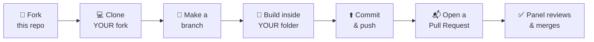

<div align="center">

# ⬡ Team i5 · Stage 2 · The Build Round

**Intel oneAPI Club · USAR @ GGSIPU EDC**

*"Talk is cheap. Show me the code."* — Linus Torvalds


[🌐 Official Site](https://adityabhatnagar.is-a.dev/iosc.i5/) &nbsp;·&nbsp; [📝 README Template](https://adityabhatnagar.is-a.dev/iosc.i5/assets/docs/PROJECT_TEMPLATE.md) &nbsp;·&nbsp; [🍴 Fork This Repo](https://github.com/adityabhatnagar1/iosc26-projects/fork)

</div>

---

## 🎉 Congratulations, you made it!

Out of 100+ entries, **15 of you** cleared Stage 1. Now it's time to show what you can *build*.

This repository is where your Stage 2 projects live. **Every candidate has their own folder.** Your whole job is simple:

> **Build your project → put it in *your* folder → send us a Pull Request.**

That's it. No one touches anyone else's folder, so nobody's work can get overwritten. 🙌

### 📌 Quick links

- [How it works (in one picture)](#-how-it-works-in-one-picture)
- [Step-by-step guide](#-step-by-step-guide)
- [What goes inside your folder](#-what-goes-inside-your-folder)
- [The five tracks](#-the-five-tracks)
- [Rules of engagement](#-rules-of-engagement)
- [Before you open your PR](#-before-you-open-your-pr-checklist)
- [Stuck? Common problems](#-stuck-common-problems)
- [Candidate folders](#-candidate-folders)

---

## 🗺️ How it works (in one picture)



**In plain words:** a *fork* is your own personal copy of this repo. You do all your work in your copy, then a *Pull Request* (PR) is you saying *"hey, please add my finished work to the main repo."* We look at it, and if everything is good, we merge it in.

---

## 🚀 Step-by-step guide

> 🔑 Replace `YOUR-USERNAME` with your GitHub username and `firstname-lastname` with **your own folder name** (see the [list below](#-candidate-folders)).

### Step 1 · Fork this repo 🍴
Click the **Fork** button at the top-right of this page (or [click here](https://github.com/adityabhatnagar1/iosc26-projects/fork)). GitHub makes a personal copy under your account.

### Step 2 · Clone your fork to your computer 💻
```bash
git clone https://github.com/YOUR-USERNAME/iosc26-projects.git
cd iosc26-projects
```

### Step 3 · Make your own branch 🌿
A branch is just a safe workspace for your changes.
```bash
git checkout -b firstname-lastname
```

### Step 4 · Open YOUR folder and build 🔧
Go into the folder that has your name, e.g. `firstname-lastname/`.
Inside, you'll find a ready-made **`README.md`**. That is your project documentation. Fill it in as you build.
Put your code, circuit files, screenshots, photos and so on into the right sub-folders (details [below](#-what-goes-inside-your-folder)).

> ⚠️ **Only touch files inside your own folder.** Don't edit the main README, don't edit other people's folders.

### Step 5 · Save and upload your work ⬆️
```bash
git add firstname-lastname/
git commit -m "Add project: <your project title>"
git push origin firstname-lastname
```
💡 Writing `git add firstname-lastname/` (instead of `git add .`) is your safety net. It only picks up files from your own folder.

### Step 6 · Open a Pull Request 📬
1. Go to **your fork** on GitHub. You'll see a yellow banner saying **"Compare & pull request"**. Click it.
2. Title it like: `[firstname-lastname] Your Project Title`
3. Fill in the checklist that appears, then click **Create pull request**.

### Step 7 · Keep improving (optional) 🔁
Need to fix or add something after opening the PR? Just commit and push to the **same branch** again. The PR updates automatically. No need to open a new one.

> 🖱️ **Not comfortable with commands?** [GitHub Desktop](https://desktop.github.com/) does all of the above with buttons. Or, as a last resort, on your fork use **Add file → Upload files** (inside your own folder), then **Contribute → Open pull request**.

---

## 📁 What goes inside your folder

Every folder is pre-built for you, like this:

```text
firstname-lastname/
├── README.md        ← your project documentation (fill in the template!)
├── src/             ← code: Arduino sketches, Python scripts, firmware...
├── hardware/        ← schematics, circuit files, wiring diagrams, BOM
├── docs/
│   └── images/      ← system diagram, final build photo, screenshots
├── tests/           ← test results, test scripts, waveforms, logs
└── media/           ← photos, short clips, extra proof
```

You can rename or add things if your project needs it, but **stay inside your folder**.

### ✍️ About your README
Your `README.md` follows the official [project template](https://adityabhatnagar.is-a.dev/iosc.i5/assets/docs/PROJECT_TEMPLATE.md). It has 9 sections: Overview, Requirements, Design, Implementation, Demonstration, Final Result, Limitations, Key Learnings and Repository Structure.

- Write it **in your own words**. No AI-generated filler. We want to read *your* story.
- Cover **every demonstration requirement** of your chosen project.
- For demo recordings, **upload to YouTube (unlisted is fine) and paste the link**. Please don't commit big video files.

### 🔒 Privacy heads-up
This repo is **public**. Anything you commit can be seen by anyone. Never commit WiFi passwords, API keys or tokens. Think twice before putting a personal phone number or email in your README.

---

## 🧭 The five tracks

You pick **exactly one project** from **one track**. Browse the full project bucket on the [official site](https://adityabhatnagar.is-a.dev/iosc.i5/).

| | Track | What you'll be doing |
|:-:|---|---|
| ⬡ | **Analog Electronics** | Filters, comparators and signal-conditioning circuits: heartbeat simulators, reflex testers, temperature alarms |
| ⬡ | **Digital Electronics** | Arduino-based counters, timers and state machines reacting to simulated sensors |
| ⬡ | **IoT & Robotics** | WiFi dashboards, small robots and IoT networks that react to simulated conditions |
| ⬡ | **Hardware & Software Orchestration** | Arduino + Python systems that stream, visualize and react to sensor data in real time |
| ⬡ | **Cybersecurity** | Python tools for password strength, breach detection and login lockout logic |

> Choose carefully. Switching projects later is only possible with **prior, documented communication with the panel**.

---

## 📜 Rules of engagement

> **Build it. Own it. Prove it.**

1. **Choose once.** One project, then commit to it. Changes need written approval from the panel.
2. **Build the whole thing.** Every requirement in your project's *Demonstration* section must be implemented **and** shown working.
3. **Show your work.** Document using the template: what you built, how it works, what you tested, what *actually* happened.
4. **Give credit.** Tutorials, libraries and references are allowed, but you must understand them and credit them. Passing off someone else's work as your own is a violation.
5. **Publish the evidence.** Code, documentation, plus photos, screenshots, waveforms, test results or demo clips, all in your folder.
6. **Ship on time.** Deadline: **As announced by the panel**. Late submissions are not evaluated unless the panel approved an exception *beforehand*.
7. **Raise blockers early.** Hardware died? Stuck on a bug? Tell us early. Honest progress beats pretending everything worked.

⚠️ **Fabricated demos, falsified results, plagiarism or deliberate misrepresentation = immediate disqualification.**

---

## ✅ Before you open your PR (checklist)

- [ ] My PR changes files **only inside my own folder**
- [ ] My `README.md` follows the template and every section is filled in
- [ ] **Every** demonstration requirement is covered
- [ ] My demo video link works (YouTube unlisted is fine)
- [ ] Photos / screenshots / waveforms are inside `docs/` or `media/` and show up correctly
- [ ] No passwords, API keys or secrets anywhere
- [ ] Everything is my own work, and all sources are credited

---

## 🆘 Stuck? Common problems

| Problem | What to do |
|---|---|
| **"I changed a file in someone else's folder!"** | Undo those changes **before** opening the PR. Not sure how? Message us. PRs that touch other folders will be sent back. |
| **"Will my PR clash with other people's?"** | No. Everyone only edits their own folder, so there's nothing to clash. Ignore the "your fork is behind" notice. |
| **"My images don't show in the README"** | Check the path (`./docs/images/name.png`) and the exact spelling. GitHub is **case-sensitive**. |
| **"Push rejected: file too large"** | GitHub blocks files over 100 MB. Upload videos to YouTube and link them instead. |
| **"I don't see 'Compare & pull request'"** | Open your fork, click the **Contribute** button, then **Open pull request**. |
| **"My hardware broke / I'm blocked"** | Tell the panel early. That's explicitly encouraged. |

Still stuck? Reach out to the panel through the channel shared with you.

---

## 👥 Candidate folders

Find your name, click your folder, and start building. The status column is updated by the panel once your PR is merged.

| # | Candidate | Your Folder | Status |
|:-:|---|---|:-:|
| 01 | **Nivranj Pahwa** | [`nivranj-pahwa/`](nivranj-pahwa/) | ⏳ Waiting |
| 02 | **Abhimanyu Shukla** | [`abhimanyu-shukla/`](abhimanyu-shukla/) | ⏳ Waiting |
| 03 | **Shyam Kumar** | [`shyam-kumar/`](shyam-kumar/) | ⏳ Waiting |
| 04 | **Dhruv Sharma** | [`dhruv-sharma/`](dhruv-sharma/) | ⏳ Waiting |
| 05 | **Gaurav** | [`gaurav/`](gaurav/) | ⏳ Waiting |
| 06 | **Nischay Sinha** | [`nischay-sinha/`](nischay-sinha/) | ⏳ Waiting |
| 07 | **Suryansh** | [`suryansh/`](suryansh/) | ⏳ Waiting |
| 08 | **Arunav Gupta** | [`arunav-gupta/`](arunav-gupta/) | ⏳ Waiting |
| 09 | **Japleen K.** | [`japleen-k/`](japleen-k/) | ⏳ Waiting |
| 10 | **Abhinav Joshi** | [`abhinav-joshi/`](abhinav-joshi/) | ⏳ Waiting |
| 11 | **Abhishek Singh** | [`abhishek-singh/`](abhishek-singh/) | ⏳ Waiting |
| 12 | **Abhav** | [`abhav/`](abhav/) | ⏳ Waiting |
| 13 | **Divyansh** | [`divyansh/`](divyansh/) | ⏳ Waiting |
| 14 | **Aman Negi** | [`aman-negi/`](aman-negi/) | ⏳ Waiting |
| 15 | **Tejas Kapoor** | [`tejas-kapoor/`](tejas-kapoor/) | ⏳ Waiting |

---

<div align="center">

**Built with curiosity, caffeine & love by Team i5** ☕

*i5 @ Intel oneAPI Club · USAR @ GGSIPU EDC*

</div>
